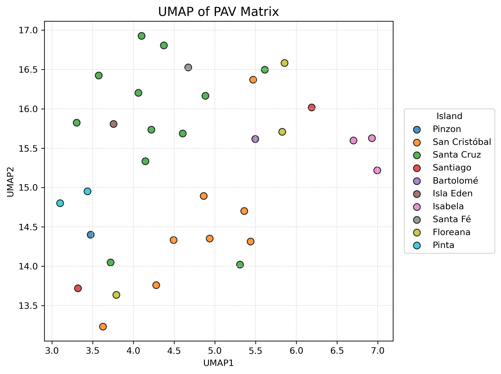
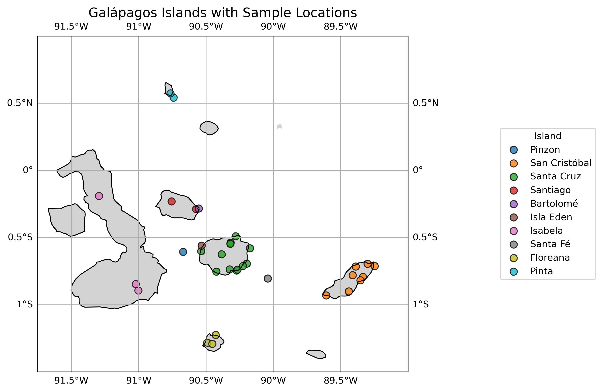

# Darwin's Daisy Project, Taken over from Gagan 20/06/2025.

---

## Index.
- [Initial handover notes](#initial-handover-notes-25062025)
- [Assessing initial quality of fastq samples](#assessing-quality-of-fastq-samples-27062025)
- [SGSGeneLoss run and read depth plot](#generating-present-genes-and-read-depth-plot-30062025)
- [Analysis of SGSGeneLoss results](#analysis-of-sgsgeneloss-results-07072025)
- [Functional annotation of GFF File](#functional-annotation-09072025---11072025)
- [GO term linkage](#getting-go-terms-for-each-gene-11072025---14072025)
- [GO enrichment analysis](#go-enrichment-analysis-14072025---15072025)
- [Running masurca](#running-masurca-on-unmapped-reads-16072025--21072025)
- [Masurca QC and filtering](#masurca-run-quality-control-22072025)
- [Remapping of masurca assembly with minimap](#alignment-of-filtered-masurca-assembly-to-the-reference-genome-23072025)

---

## Initial handover notes (25/06/2025).
I met with Dave, A few of the postdocs and Gagan to discuss handover of the project on the 20/06/2025. To discuss the 
further work needed for the project. We came up with a list of tasks that needed doing. These are listed below:

* Look for a multiqc report to check quality of each sample and ensure that we are confident with all samples before 
moving forward as Gagan had some issues with read depth in her results' analysis.
* Generate a plot showing number of genes called as "present" against read depth for each sample. The curve should look 
like a cliff, with read depth tapering off as you move from right to left through the curve. This will help us to see 
which samples need fixing.
* Call presence/absence annotation with SGS gene loss.
* Run masurca annotation with the original genome. Will need to look into how the original genome was annotated. For
help with maker, I can ask Tessa. She has lots of experience with it. This can be done in parallel to the sgs gene loss
analysis.
* Gene ontology analysis (after sgs gene loss results have been generated).
* Map unmapped contigs back to the reference genome (the unmapped contigs have already been filtered). - Apparently 
Teng can help me with this.

## Assessing quality of fastq samples (27/06/2025).
I downloaded the multiqc report Gagan generated to look over and see if it could explain why some samples are showing
a large amount of gene loss. The multiqc report is [here](reports/initial_multiqc_report.html). The report showed that
despite passing quality thresholds, the number of total reads for some samples were very low, this means that the
depth of coverage of the genomes for these samples may not be good enough to cover all the present genes and hence 
would lead to the large loss of genes Gagan observed in her thesis. This was confirmed in the 
[mapping report](reports/mapping_multiqc_report.html) that showed that all samples had a high rate of alignment but 
likely do not have a good depth of coverage.

To a suitable threshold for suitable depth, The read depth plot below will be informative. It may even be informative
to show raw read count per sample against number of genes called as present.

## Generating present genes and read depth plot (30/06/2025).
Gagan's sorted .bam folder only contains 26 bam files. I am going to use the raw_bams to complete the merge, as 
there should be 34 samples according to the [metadata](metadata/raw_sample_metadata.xlsx)

To Generate the plot I will complete the following workflow:
* Get read depth per .bam file using `samtools view -c -F 260 <sample>.bam`. This will get the number of mapped reads.
* Count genes per .ba, using `featureCounts -a .gff -o counts.txt <sample>.bam`
* Define "Present". I.e. what threshold should determine if a gene is classed as present or not.
* Combine results into a table with columns `sample`, `Mapped read count`, and `Genes present`.
* Plot with Python.

Things to think about.
To assess how gene detection behaves at lower depths within the same sample, I could take a subsample of each of the 
.bams.

### Update 30/06/2025.
I finished merging the bam files and running SGSGeneLoss on the samples on the date specified. I saved the merged bams
under the pshell directory: `NGS Analysis results/rawdata/Darwins_Daisys/merged_bams_jb`. This will allow me to keep the
bam files separate from the ones generated by Gagan.

I merged the excov files from SGSGeneloss, graph.csv and stats.txt files for each sample above to the directory: 
`NGS Analysis results/rawdata/Darwins_Daisys/sgsgeneloss_out_jb/`. This folder contains 103 files that consist of 
the following:

* 1x merged.excov file for each sample.
* 1x stats.txt file for each sample.
* 1x graph.csv file for each sample.

A singular chrs.csv file containing the chromosome order for each sample (will be the same for each sample). The
directory contains 103 files in total.

### Analysis of Alignment results (30/06/2025).
Before checking the SGSGeneloss results, I ran [this](scripts/bam_stats/visualise_bam_stats.py) parser script to 
summarise the alignment statistics. Due to the results Gagan had with her SGSGeneLoss run, I wanted to check that each
sample had aligned with a high percentage. After analysis of the results I concluded that all samples looked good, with 
the lowest mapping rate of the 34 samples at 93.14 %, with a mean alignment percentage of 94.7% between all samples.

All samples seemed to have a good read count, with the lowest sample scoring 127M total reads and an average of around
200M reads.

## Analysis of SGSGeneLoss results (07/07/2025).
I ran SGSGeneloss on the merged bam files and ran the outputs through this [script](scripts/sgsgeneloss/merge_excovs.py)
to merge the excov files for each sample. I then generated a report using the output files using this
[script](scripts/sgsgeneloss/plot_stats.py) the final report for this run of the SGSGeneLoss can be viewed
[here](reports/sgsgeneloss_report.html).

The initial SGSGeneloss results were promising, and after confirming with Dave and Mitch we agreed that all the 
samples in the cohort contain suitable read depth/coverage to provide accurate presence/absence variation results.

### Clustering of samples.
The initial PCA results of the PAV matrix during the generation of the report above showed that there seems to be some
expected clustering of samples. I spent some time into looking into what would be the best method of comparing
clustering results for this dataset (binary). And decided to replace the PCA plot with a UMAP plot to look at sample
clustering.

The figure below shows UMAP analysis of the 34 sample PAV data, with dots colored according to the island the samples 
were taken from:



The plot shows some rough clustering between samples from different islands, although there are some samples from
those islands that do not cluster well. I also generated a plot that maps the sample longitude and latitude to thier
co-ordinates around the Galápagos Islands themselves. Here is the plot:



### Optimisation of UMAP parameters (13/08/2025).
After speaking with Teng, he mentioned that I may be able to add some optimisation for the UMAP of the samples by 
adjusting the number of principal components and n_neighbours. 

## Functional annotation (09/07/2025) - (11/07/2025).
In order to provide a more informative analysis of which genes are retained/lost in each sample. I need to add 
additional annotation to the maker-generated gff3 annotation file used to run SGSGeneloss. In order to provide 
additional functional annotation, I extracted CDS and protein sequences (as fasta files) 
of each feature in the gff3 file using the `gffread` package. 

I then used the `diamond/2.1.12` to do an initial screen of the fasta files for high quality hits against the
uniprot database. In order to output a file that contained taxonomy information, I needed to provide some additional
files to the diamond database build. I followed the instructions 
[here](https://github.com/bbuchfink/diamond/wiki/3.-Command-line-options) in order to build that database using a
file to map protein accessions to taxonomy accessions.

(Protein -> Taxonomy) mapping file:
`wget https://ftp://ftp.ncbi.nlm.nih.gov/pub/taxonomy/accession2taxid/prot.accession2taxid.FULL.gz` 

Taxon information for the database was obtained using:
`wget ftp://ftp.ncbi.nlm.nih.gov/pub/taxonomy/taxdump.tar.gz`. The database was built using the following bash command

Then with `diamond`:
```bash
diamond makedb \
  --in uniprot_sprot.fasta \
  --db uniprot_sprot \
  --taxonmap prot.accession2taxid.FULL \
  --taxonnodes nodes.dmp \
  --taxonnames names.dmp
```
Before running the blast command I ran [this](/scripts/functional_annotation/clean_proteins.py) script on the gffreads 
`protein.fa` output file to clean the sequences and make sure any invalid characters were removed from the dataset
passed in to diamond. 

Finally, I ran this code to run a `blastp` search against the uniprot_sprot diamond database generated above using this
script: [this](/scripts/functional_annotation/diamond_blast.sh) script. To generate the output file: 
`diamond_results_protein.tsv`. That was transferred to my local PC for data analysis.

Before continuing the analysis I wanted to get a good idea of the number of proteins that had significant blast hits.
[this](/scripts/functional_annotation/annotation_analysis.py) python file was used to generate some statistics for 
the functional annotation results of the initial diamond blast hits.

Here are some summary statistics for the initial diamond results:
* Diamond results contained blastp results for 36070 features (out of a total of 43093 in the original gff file).
* All 36070 queries were unique.
* Diamond hits by "identity" are normally distributed around the 60% sequence similarity. 
* Majority of top blast hits for the gff3 file against uniprot_sprot database were from plant kingdom "Viridiplantae".
* 23506/43093 features in the gff3 file returned a top hit against "Arabidopsis".

### Getting GO terms for each gene (11/07/2025) - (14/07/2025).
I cannot retrieve GO terms directly from the diamond blastp , but I can screen the protein ID's against uniprot to
obtain a list of GO terms. 

In order to apply a computationally efficient approach I downloaded the Uniprot GO term mapping file to Setonix using:
`https://ftp.uniprot.org/pub/databases/uniprot/current_release/knowledgebase/idmapping/idmapping_selected.tab.gz`

I then created a list of unique accession_id's from the output of the `diamond blastp` file:
[diamond_results.tsv](/data/functional_annotation/diamond_results_protein.tsv). Using the command:
`cut -f2 diamond_results.tsv | cut -d'|' -f2 | sort -u > accessions.txt`

Finally, I `gunzip`'d the mapping file and then screened it for the unique accessions created above using the
command: 
```bash
awk -F'\t' '
  NR==FNR {acc[$1]; next}ls
  ($1 in acc) && $7 != "" {
    go[$1] = go[$1] ? go[$1]";"$7 : $7
  }
  END {
    for (id in acc) {
      print id "\t" (go[id] ? go[id] : "NA")
    }
  }
' accessions.txt idmapping_selected.tab > go_mapping.tsv
```
The above command will read all accessions from `accessions.txt`, extract all the GO terms for those accessions,
group multiple GO terms per accession as separated by a semicolon, ensures that every accession from the list appears
in the output with "NA" if no GO terms are found.

Finally, I confirmed that both files had the same number of lines with `wc -l`. This check confirmed that out of the
43093 structural features identified in the gff file, 11771 were mapped to GO-terms using the top blastp hit via
`diamond blastp`.

I merged the file containing the GO terms and accessions to my diamond blast file using an inner join and the 
Python script [here](/scripts/functional_annotation/merge_go_terms.py). I wrote the output of this file to
[here](/data/functional_annotation/go_merged_diamond_results_uniprot.tsv).

I will use this file to do some GO enrichment analysis using the Go terms from uniprot as well as the presence/absence
variation matrix [here](/data/sgsgeneloss/pav_matrix.csv)

## Go enrichment analysis (14/07/2025) - (15/07/2025):
First of all I thought it would be a good idea to get an overview of which Go terms are most common in my dataset,
this will allow me to establish a functional landscape and give a broad overview of which go terms are most 
represented by the hits.

[This](/scripts/go_enrichment/analyse_go_terms.py) Python script was used to generate all go-term related 
analysis. It also contains the code used to generate a human-readable GO-id : Go-term readable file, that provides a 
human-readable mapping of each go-id that can be used to make any subsequent figures more readable. The input file for 
this was obtained from this link: `https://geneontology.org/docs/download-ontology/`. The `go-basic.obo` was downloaded
and parsed with python to create the mapping file.

I generated two plots to get a general overview of the top GO terms overall, and by namespace within the overall 
dataset (all 11771 hits). These plots are shown below:


I then filtered the Go-annotated diamond blastp results dataframe into two groups:

1) `Core` hits - Out of 41105 core genes/features in the pav dataframe, I was able to generate hits for 34562
2) `Non-core` hits - Out of 1988, I was able to generate hits for 1508.

These hits were generated using the uniprot-sprot database, cross-referenced with associated GO terms. I then reran 
top GO-terms by count for the `core` and `non-core` gene list. The results are shown below:

Background dataset (all-genes):


Core genes (Genes marked present in all samples.)


Non-core genes (genes marked as absent in at least one sample).


The results above give a good indication as to the results we might expect to see through a gene enrichment analysis.
I will run a gene enrichment analysis using the `goatools` python package, which I was able to install with conda on
my local pc. The script use to run the GO enrichment analysis is [here](/scripts/go_enrichment/go_enrichment.py)

### Update 18/07/2025 - 22/07/2025.
After Discussing with Dave, I will have a more thorough look into absent genes that are associated with the 
terpenoid pathway. The number 1 scoring go term in the non-core gene lists. This 
[script](/scripts/go_enrichment/filter_by_go.py) was used to complete that analysis. Taking these results,
I also completed a small review to assess future directions that we could take the project. This work is located
[here](/reports/sgsgeneloss_gene_analysis.docx)

### Update 24/07/2025.
After sending the report above to Dave we discussed a future directions for the gene loss analysis. I will outline these
below:

1) Find a non-island daisy relative to compare results to.
2) Compare the extent of parthenolide loss between species.
3) Compare the extent of parthenolide loss between islands.
4) Map the gibberellin genes to a pathway to get a better understanding of what is going on. Is there any other genes 
in the pathway that might be flagged as a different GO term that are showing gene loss?
5) Compare gibberellin gene loss between species.
6) Compare gibberellin gene loss between islands.

In order to keep this report is a somewhat chronological order I will start a new section to document the 
above analysis.

## Running masurca on unmapped reads (16/07/2025) -(21/07/2025).
Masurca prefers untrimmed reads for the assembly. In order to collect these I had to download the raw .fastqz files from
`pshell` and merge them by sample using this [script](/scripts/masurca/merge_daisy_raws_fastq.sh). Once I had merged the
reads, I then extracted the untrimmed versions of the unmapped reads using this 
[script](scripts/masurca/extract_unmapped.sh) to retrieve the untrimmed version of the unmapped reads from the raw
fastq files. The unmapped_untrimmed reads were uploaded to pshell at the directory:
`NGS Analysis Results/rawdata/Darwins Daisy/untrimmed_unmapped_fastqs_jb`

I estimated the average insert size and STDEV of a few samples using `bbmap merge` to give the following results:

* AVG insert size: 231
* AVG insert STDEV: 33.2

Finally, I used this [script](/scripts/masurca/run_masurca.sh) to run the masurca assembly. With the maximum single 
`work` node allocation of 128CPUS and 230GB mem. This run failed so I reran using the `highmem` partition, reduced the 
number of cpu's down to 64 and upped the memory requirements to 300GB. This run completed. I copied the masurca output 
files to `pshell` at the following directory:

`NGS Analysis Results/rawdata/Darwins_daisy/masurca_output_jb`

I used the `quast` programme, installed via `conda` to analyse the results of the _de novo_ alignment. The results are
stored [here](/reports/masurca_quast_report.html).

Here are some summaries of the initial alignment:

* Number of contigs: 171908
* Contigs over 1000BP: 83859
* Contigs over 5000BP: 9357
* Contigs over 10000BP: 1212

### Masurca run quality control (22/07/2025).
I sent the masurca report to Mitch and Dave and we agreed the overall number of contigs is high. I am going to run
a filter for mitochondrial and chloroplast DNA on the assembly to assess and filter how many contigs likely belong to
organelles and then can move on to look for other contamination, such as bacteria.

In order to see which contigs belong to mito/chloroplasts I will run a `blastn` search against mitochondria and 
chloroplast complete genomes from the following NCBI accessions for the common sunflower using this 
against these reference fastas:

* NC_007977.1 (chloroplast).
* NC_023337.1 (mitochondria).

The following code shows the process used to remove contigs that were flagged as mitochondrial/chloroplast DNA from the
primary masurca scaffold using blastn and entrez-direct packages:

```bash
efetch -db nucleotide -d <ID> -format fasta > <NCBI_reference>.fasta
makeblastdb -in <NCBI_reference>.fasta -dbtype nucl -out <NCBI_reference>_db
blastn -query <masurca_assembly>.fasta -db <NCBI_reference>_db \
       -outfmt '6 qseqid sseqid pident length evalue bitscore' \
       -evalue 1e-10 \
       -out <hits>.tsv \
       -num_threads 16
```

Once I had generated blast databases for both NCBI accessions. I then ran the following code to create a list of
unique hits using the two .tsv files to create a file: <all_organelle_hits>. Then used seqtk `grep` to remove these hits
from the original masurca assembly.

```bash
cat <hits1?.tsv> <hits2.tsv> | sort | uniq > organelle_contigs.txt
seqkit grep organelle_contigs.tsv primary_masurca_assembly.fasta > filtered_masurca_assembly.fasta

# A few checks to make sure that the primary masurca fasta file was actually filtered.
grep -c primary_masurca_assembly.fasta
grep -c filtered_masurca_assembly.fasta
```

I also saved the mitochondria and chloroplast filtered masurca assembly to `pshell` at the directory:
`NGS Analysis Results/rawdata/darwins_daisies/masurca_output_jb/filtered.genome.scf.fasta` I also saved the list of 
contigs that were filtered out from the masurca assembly under the same folder with the filename 
`sunflower_organelle_contigs.txt` I also saved the fasta sequences as `sunflower_chloro.fast` and `sunflower_mito.fasta`
under the same folder.

## Alignment of Filtered masurca assembly to the reference genome (23/07/2025) - 29/07/2025.
The next step in the generation of the pan-genome involved remapping the filtered masurca assembly to the original
_scalesia_ reference file. This can be downloaded from pshell here: 
`NGS analysis results/rawdata/darwins daisies/REF_FILE/.fasta`.

Once I had downloaded this file, I used it as the reference, and aligned the masurca contigs that had been filtered to
remove mitochondrial/chloroplast DNA using this [script](/scripts/masurca/run_minimap.slrm).
See below for some basic mapping statistics generated using the `samtools stats` command:

* Total contigs: 313 873.
* Mapped contigs: 256 090
* Unmapped contigs: 57 783
* Average contig length: 1092BP
* ~85% of contigs mapped.
* 20% mismatch rate. - High because this alignment is from multiple _scalasia_ species.

I then extracted the unmapped reads from this alignment using the following code, to generate a list of completely 
unmapped contigs:

```bash
samtools fastq -f 4 alignment.bam > unmapped_reads.fastq
seqtk seq -a unmapped_reads.fastq > unmapped_reads.fasta
```

The unmapped_reads.fasta generated by `samtools` contains 57 783 contigs. 

Finally, I used this array [script](/scripts/masurca/run_blastn_array.slrm) on the unmapped contigs to run a `blastn`
search that I can use to filter out non-plant material. The blastn search did provide `staxid's` but did not give phylum
information, so I carried out the following steps to generate a dataframe with the `blastn` data as well as the 
taxonomic data needed for filtering.

1) Extracted all unique staxID's from the `blastn_output.tsv` file.
2) Used the package `Taxonkit` (installed using bioconda) to generate the kingdom/phyla/species information needed for
the analysis wit the following code: 

```bash
cat taxids.txt | taxonkit reformat2 -I 1 > taxdata.txt
sed 's/;/\t/g' taxdata.txt > taxdata.tsv
```

3) Built this [Python script](/scripts/masurca/merge_blastn_taxonomy.py) to merge the taxonomic information back to the
blastn results .tsv file using an inner join on the `staxid`.

Using the merged dataframe I could then generate some summary statistics for the unmapped contigs and some plots using 
the Python script [here](/scripts/masurca/unmapped_contig_blastn_plots.py)
* 6338/57634 unmapped contigs were of "streptophyta" phylum origin - 10.99%.
* 149 contigs did not return any significant `blastn` hits with pvalue 1e-5.
* Dataset seems to contain a large amount of bacterial contamination.
* Helienthus Annus (sunflower) was the most common plant species within the 6000 plant contigs.

I generated some [plots](/plots/masurca) That summarise the `blastn` information. I also generated a list of plant-only
contig ID's and saved these [here](/data/masurca/plant_fasta_ids.txt).

### Merging plant contigs back to original assembly (30/07/2025).
I transferred the list of [plant contig id's](/data/masurca/plant_fasta_ids.txt) to setonix and used the following code 
to extract the relevant fasta sequences to a new file:

```bash
conda activate biogenerics
seqtk subseq unmapped_reads.fasta plant_fasta_ids.txt > unmapped_plant_only_contigs.fasta
echo "IDs in list: $(grep -c '^[^#[:space:]]' plant_fasta_ids.txt)"
echo "Sequences in FASTA: $(grep -c '^>' unmapped_plant_only_contigs.fasta)"
seqkit stats unmapped_plant_only_contigs.fasta
```

This created the summary information: 
* Num seqs = 6338
* sum_length = 2352603
* min_len = 113
* avg_len = 371.2
* max_len 5580

I also created a list of the contigs that did not return a `blastn` hit using the following code snippet:

```bash
cut -f1 final_blastn_results.tsv | sort -u > blastn_hit_ids.txt
grep "^>" unmapped_reads.fasta | sed 's/^>//' > all_unmapped_fasta_ids.txt
comm -23 <(sort all_unmapped_fasta_ids.txt) <(sort blastn_hit_ids.txt) > no_blastn_hit_ids.txt
seqtk subseq unmapped_reads.fasta no_blastn_hit_ids.txt > no_hit_novel_contigs.fasta
echo "Number of no-hit IDs: $(grep -c '^[^#[:space:]]' no_blastn_hit_ids.txt)"
echo "Number of sequences in FASTA: $(grep -c '^>' no_hit_novel_contigs.fasta)"
```

This created the summary information: 
* Num seqs = 154
* sum_length = 43268
* min_len = 121
* avg_len = 281
* max_len 1462

I concatenated the novel contigs and plant contigs into a merged file: `unmapped_plant_plus_nohits.fasta`

## Further Presence Absence Variation Analysis (24/07/2025).
Dave has been interested in whether we can observe gene-loss over time, under the hypothesis that Darwin's daisy 
originated on the Galápagos through a single original migration event. This seems to be the current accepted theory 
with some papers hypothesising that this migration even occurred somewhere amongst the central islands.

To test this theory I decided first to look at the non-core PAV matrix. I used this 
[script](/scripts/go_enrichment/non_core_presence_v_distance.py) to calculate the distance in KM of each of the samples
from the centre of the island "Santiago", one of the centre islands in the Galápagos. I then created a count matrix of
total number of present genes for each sample and plotted this on the y-axis. Below shows the result:


A linear regression analysis using these parameters showed no significant correlation between the number of genes and 
the distance from santiago. However, a GLM (Poisson Model) showed that there was a very small negative correlation with
a pvalue of 0.028 and R squared value of 0.132.

In order to try and get a better understanding of the results I created a subset of the non-core genes by filtering the 
PAV matrix removing any genes that were NOT associated with any of the 15 top most enriched GO terms for the non-core
dataset. The results for this analysis are below:


Both a standard linear regression and GLM (Poisson Model) showed a significant negative correlation between distance 
from Santiago and the number of genes belonging to the top 15 most enriched GO terms within the non-core dataset. I will
need to interpret this result to try to explain why the subset shows a greater correllation compared to the whole 
non-core gene set. Below are the results of the statistical tests for the non-core GO subset used to generate the 
figure

* Standard linear regression - p <0.001 , R squared = 0.43
* Poisson Regression (GLM) - p = 0.036, R squared = 0.1215

Possible explanations:
* Founder effect - migrations island to island leads to decreased genetic diversity.
* Non-core genes associated with GO terms may be less essential so could be lost in these bottlenecks.
* Non-core genes may contain neutral genes. The go enriched subset may have a stronger selection pressure against them.

## PAV comparison with a mainland species.
Dave thinks it would be a good idea to compare the results obtained from our PAV dataframe with that of a mainland 
species. After spending some time looking at accessions on GenBank. I found one that may be suitable for comparison.
_yacon_ or _Smallanthus sonchifolius_ is a central American species of Daisy that is native to ecuador so should show
a decent amount of phylogenetic similarity. I found a genbank accession 
available here: https://www.ncbi.nlm.nih.gov/sra/SRX19296250[accn]/ from 2023 that provides a download link for raw
Illumina 150BP shotgun sequencing paired end files.

Using these I can create an alignment against the reference genome used to generate the daisy `.bam` files. This will
enable me create a PAV matrix using the same gff file that was used to create the darwin's daisies PAV. to get the files
in paired fastq format I used the following code snippet:

```bash
mamba install -c bioconda sra-tools
prefetch SRR23354904
fasterq-dump SRR23354904 --split-files --outdir ./yacon_reads
```

I then cleaned the reads using `fastp`, similar to the daisy samples with the following command:
`fastp -i 1.fastq -I 2.fastq -o 1_cleaned.fastq -O 2_cleaned.fastq -q 20 -u 30 -l 50 -h fastp_report.html`

I then ran a bowtie2 and samtools using the island reference genome on the cleaned reads to generate a mainland `.bam`
file using the following code:

```bash
bowtie2 --end-to-end --sensitive -x <island_reference> -1 1_cleaned.fastq -2 2_cleaned.fastq --threads 32  \ 
        | samtools sort -@ 24 -o mainland_sorted.bam
samtools index -@ 32 mainland_sorted.bam
samtools stats -@ 32 mainland_sorted.bam  > mainland_sorted.stats
```
See below for summary information on the alignment:

* Total paired-end reads: 20,439,817
* Overall alignment rate: 94.97%
* 5.04% of individual mates failed to align at all
* 0.83% aligned uniquely
* 94.12% aligned to multiple positions (multi-mapped)

These results suggest a high genomic divergence between the mainland species and the island reference (as would expect).
Should be suitable for PAV matrix generation, but not optimal for precise structural or variant analysis.

I then ran sgsgeneloss on the `mainland.bam` file using with the following command. Using the default program parameters
used for the other samples:

```bash
java -Xmx4G -jar "$SGSGENELOSS_JAR" bamPath=./ bamFileList=mainland_sorted.bam gffFile= <gff_file \ 
outDirPath= . chromosomeList=all
```

This generated SGSGeneLoss results for the mainland species using the same gff file used to generate the PAV matrix for
the main sample set. I.e results are directly comparable as they will contain the exact same structural annotations.
I downloaded the results to my local PC to creat The PAV data for the mainland species and ran an inner join on the
column with the sample PAV matrix in order to make a dataframe that enabled comparison of results.

I then followed the same process outlined [here](#analysis-of-sgsgeneloss-results-07072025) to generate the PAV data
for the mainland species. I realised that the PAV matrix for the mainland species with the island bases gff3 file showed
mostly absent genes. Here are some summary statistics:

* 398/43023 genes were flagged as "present" using the current SGSGeneloss parameters.

It may be better to rerun SGSGeneloss using more relaxed parameters to see it this increases the presence/abcence
data allowing for the higher degree of divergence between the island and mainland species.

I decided to rerun SGSGeneloss with relaxed parameters: 
```bash
java -Xmx4G -jar "$SGSGENELOSS_JAR" bamPath=./ bamFileList=mainland_sorted.bam gffFile= <gff_file> \ 
outDirPath= . chromosomeList=all minCov=0.8
```

I then Regenerated the PAV data and checked to see how many Genes were marked present with the new parameters and 
increased the number of present genes to 428. I am going to try further reducing the MinCov parameter to 0.5 as a final
attempt with these parameters:

```bash
java -Xmx4G -jar "$SGSGENELOSS_JAR" bamPath=./ bamFileList=mainland_sorted.bam gffFile= <gff_file> \ 
outDirPath= . chromosomeList=all minCov=0.5
```

## Phylogenetic analysis using PAV matrix (05/08/2025).
Teng thought it would be a good idea to try to visualise sample similarity using a phylogenetic tree generated using 
the PAV data. I wrote the code for this in this [script](/scripts/sgsgeneloss/nj_pav_tree.py). I used 
Hamming distance as the metric used to generate the phylogenetic tree. Another option would be to use Jaccard, but this
will only take into account presence rather than presence and abcence.

The tree was produced using neighbourhood joining as it is a general method and does not assume a constant rate of 
evolution. Generated reasonable accuracy. May need to look into running again with UPGMA.

May be a good idea to take some of the genes and run a Maximum-likelihood/baysian inference analysis using sequencing 
data to back up the story of gene loss. Does it cluster similar to the phylogeny analysis of the PAV matrix?.

The `.nwk` file for the tree is saved [here](/data/sgsgeneloss/phylo_pav_tree.nwk).
The annotation file for Itol is saved [here](/data/sgsgeneloss/PAV_itol_annotation.txt)

Mitch also generated a MASH plot using the `mashtree` package. The .nwk file is saved 
[here](/data/sgsgeneloss/Daisies_all_mashtree_output.nwk). The Itol annotation file is saved 
[here](/data/sgsgeneloss/MASH_itol_annotation.txt).

There are some similarities between the two trees. I used the `ete3` package to plot the two trees side-by-side for 
comparison using this [script](/scripts/sgsgeneloss/compare_pav_trees.py).

## Running maker to annotate filtered masurca assembly (07/08/2025).
In order to run maker to annotate the assembly produced by masurca I will need some protein data that can be used by
maker to inform the annotation. For the first round I will use the following databases;

* Helianthus annus - Common sunflower (model organism in daisy family). I downloaded the proteome from this reference 
accession on [NCBI (refseq)](https://www.ncbi.nlm.nih.gov/datasets/genome/GCF_002127325.2/) as well as the mRNA data.

* Arabdiposis thaliana - A very well studied plant model organism. Not in the Diasy family but will have extended
annotation. I downloaded the proteome and mRNA data from this 
[NCBI link](https://www.ncbi.nlm.nih.gov/datasets/genome/GCF_000001735.4/) I used the GenBank accession file 
`GCA_000001735.2` (Arabidopsis) and `GCA_002127325.2` (Helianthus).

* The protein data from the scalasia reference genome available. (mRNA data was not available) 
[here](https://datadryad.org/dataset/doi:10.5061/dryad.8gtht76rh)

I may add this in a future round:
* A more general collection of reviewed plant proteins from all Streptophyta species from UniProt:
[Uniprot query](https://www.uniprot.org/uniprotkb?query=%28taxonomy_id%3A35493%29&facets=reviewed%3Atrue)

### Running Repeat-modeler + RepeatMasker to define repeated regions of the pan genome.
Before running Maker, I need to mask repeated regions of the genome using these two software. To do this I used the code
snippet below after installing the two software's using `conda`:

```bash
cat scalesia_atractyloides.reference.fasta final_filtered_pangenome.fasta > final_pangenome.fasta
BuildDatabase -n darwins_db final_pangenome.fasta
RepeatModeler -database darwins_db -threads 64 -LTRStruct
RepeatMasker -pa 64 -lib consensi.fa.classified -dir repeatmasker_out -a final_pangenome.fasta
```
I then concatenated all files for the protein and all files for the mRNA datasets to use for the `maker` and used
the soft masked version of the .fasta file as the input for maker the soft masked file is saved [here]()

I then used this script and these config files to run [maker round 1](/scripts/maker_round_1)

## Generating Maximum likelihood tree using SNP's (11/08/2025).
In order to really understand the migration patterns, I need to check to see how the species compare to each other 
evolutionarily using a maximum likelihood tree. This will confirm if we are seeing back-migration through the 
PAV matrix. In order to generate a maximum likelihood tree, I used the following process:

I first generated a list of sorted `.bam` files for each of the 34 samples using this [script](/script/ml_tree/). I
then used the following code snippets to generate a .vcf file containing high quality SNP's for each sample that can be
used to build the tree.

```bash
bcftools mpileup -Ou -f ../000000_dd_reference/scalesia_atractyloides.reference.fasta \
-b sortedbamlist.txt -q 20 -Q 20 -C 50 -a FORMAT/DP,AD --threads 32 > ../250811_ml_tree/raw.bcf
```
