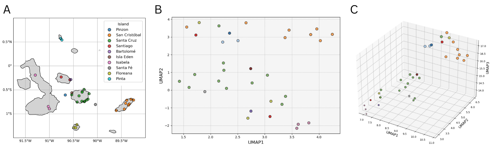

# Phylogenomic Insights Into the Diversification and Population Structure of _Scalasia_ Within the Galápagos Islands.
## Abstract

## Introduction.
* https://www.sciencedirect.com/science/article/pii/S0960982220313506 supports the idea that _scalasia_ may have migrated 
outwards from one of the central islands of the Galápagos. Any other papers that support evidence for this?
* Previous studies that have shown gene loss occurs across island species away from migration point - can I find a good example of this?
* What are the typical genes that show gene loss in these species. Immune genes etc.
* 

[## Materials and Methods.

### Bioinformatic processing of _Scalesia_ samples.
The genome for _Scalesia atractyloides_ was used as the reference dataset for this study, obtained from the 
existing DOI: Dryad: 10.5061/dryad.8gtht76rh [ref]. The FASTA file was indexed using Bowtie2 (v2.4.5)
[ref] and used as the reference to align each of the thirty-four _scalasia_ genomes detailed below.

Illumina paired end reads were obtained from [complete] for thirty-four individuals within the Galápagos Islands, 
collectively representing eighteen different _scalasia_ species [supplementary table with meta-data]. Initial read 
quality metrics were obtained using FastQC (v0.11.9) [ref]. Paired samples were then processed with Trimmomatic with
parameters:

`ILLUMINACLIP:$ADAPTERS:2:30:10 LEADING:3 TRAILING:3 SLIDINGWINDOW:4:15 MINLEN:99 TOPHRED33`

Post-trimmed quality was assessed with FastQC/MultiQC (v1.12) [ref]. Trimmed FASTA files were aligned to the reference 
genome using Bowtie2 (v2.4.5) with the --sensitive flag and insert size parameters -I 0 -X 1000.
sorted BAM files for the thirty-four samples were generated with Samtools (v0.5.0) with `view`, `sort` and 
`index` commands (default parameters). Initial alignment metrics were generated with Samtools `stats` and visualised
using a custom Python script [maybe more info].]()

### Generation of Presence/Abcence Variation Matrix.
The GFF annotation file for the reference dataset was downloaded using the same DOI above and utilised in tandem with the
SGS Gene Loss (v0.1) [ref] package to call gene loss of each sample against the reference dataset on each of the 
thirty-four _scalasia_ BAM files. SGS Gene Loss was run using default parameters to obtain presence/abcence calls across
a total of 43093 features within the GFF file.

A custom Python script [more info] was run to parse SGS Gene Loss output .excov files to determine if each 
sample contained adequate read depth/coverage to prevent the calling of false abcence of features. [Table here>
All thirty-four samples were considered suitable for further analysis. A custom Python script [link] was used to filter 
the PAV matrix for non-core genes - defined as genes absent in at least one individual.

### UMAP clustering of PAV matrix.
UMAP analysis was run using the python package UMAP [version]. The model was run using parameters:
random_state=42, metric="hamming" and n_neighbours=7. All other parameters were left as default values. UMAP models 
were run using n_components=2 and 3 to generate 2D and 3D plots respectively. For the 3D UMAP, points were scaled using
the UMAP-Z coordinate to enhance depth perception, legends were removed for clarity. 

### Functional Annotation of The _Scalesia atractyloides_ Reference GFF.
Protein sequences were extracted for each feature of the _Scalesia atractyloides_ GFF file using the Gffread package
(v0.12.7) [ref] with default parameters. The resulting protein sequences were cleaned using a custom Python script [link]
to ensure all protein sequences were compatible for BlastP search.

The Diamond package (v2.1.2) `makedb` command was used to generate a Diamond database file from the Uniprot-Sprot 
collection of proteins [expand], using the instructions available here [link], under section `Makedb Options`, run with flags --taxonmap,
--taxonnodes and --taxonnames. The Diamond database was used to run a BlastP search of all GFF file proteins using the 
following code snippet, to return all hits paired with associated taxonomy information:

`diamond blastp -q protein_clean.fa -d uniprot_sprot.dmnd -o diamond_results.tsv -p 64 --sensitive -e 1e-5 -k 1 
--outfmt 6 qseqid sseqid pident length mismatch gapopen qstart qend sstart send evalue bitscore staxids stitle sscinames
  sskingdoms skingdoms sphylums`

Hits with E-value < 1e-5 were considered statistically significant. Resulting BlastP hits were annotated with GO terms 
using the publicly available Go term mapping file available here:
https://ftp.uniprot.org/pub/databases/uniprot/current_release/knowledgebase/idmapping/idmapping_selected.tab.gz,
using a custom Python script and the Obonet package [version] to merge GO terms with BlastP hits using the 'staxids'
field. The top high confidence hit (if multiple hits) was used to provide functional annotation of the feature. 

### Gene Enrichment Analysis.
A custom Python script [link] was used to map GO terms from the BlastP hits to their human-readable descriptions using 
the publicly available mapping file `go-basic.obo` available for download here: https://geneontology.org/docs/download-ontology/.

Go enrichment analysis was performed using the `goatools` (v1.4.12) [ref] Python package using the function 
GOEnrichmentStudy() with parameters: `alpha=0.01, methods=["fdr_bh] propagate_counts=True. Fishers exact test was used
to assess significance. GO terms with P < 0.01 were considered significant. 

### Phylogenetic analysis.
The presence abcence binary matrix generated above was used to assess phylogenetic relationships with the `scikit-bio`
Python package (v0.7.0) DistanceMatrix() function run using a custom Python script [link]. Distance metrics for the tree
were generated using Hamming's metric. To generate a second tree... [mitch to finish]

## Results.

### UMAP Analysis Shows Spatially Close Individuals Share Similar Feature Absence Profiles.
To investigate presence/abcence variation of the _scalesia_ Genus within the Galápagos, we assembled genome sequences for 
thirty-four _Scalasia_ individuals [ref?], collected from 10 different islands around the Galápagos Archipelago [F1.1].
These samples collectively represented a dataset of eighteen different _scalasia_ species. Raw sequencing files for each
sample were quality-checked and aligned to a pre-existing reference genome for _Scalesia atractyloides_ [ref].
Alignment metrics indicated a high percentage mapping rate, with a minimum alignment percentage of 93.14% within the 
sampleset. .bam files were generated for each sample and the SGSGeneLoss package, was used to generate a presence/abcence
variation (PAV) binary matrix of the thirty-four samples against 43094 structural features.

Output files from the SGSGeneLoss package were parsed to assess whether depth of coverage
was high enough (>10x coverage) to account for real abcence of genetic features. [F1.2] . [evidence to show suitable coverage F1.X]
The PAV matrix was filtered to identify 1988 unique features within the dataset hereby defined as non-core (missing in at 
least one individual). The non-core dataset accounted for 4.6% of the 43093 features described within the reference GFF 
file. [EXPAND - is this typical?]

[Could expand more - analysis of lost gene length etc. also histogram of number of genes lost per sample.]

[Could also expand more into island groups, where we group islands by geographic location to reduce amount of colors on the plot]

To assess the extent and pattern of feature abcence variation between individuals, UMAP analysis was performed on the 
PAV matrix and compared with sample metadata [sup table linking to sample metadata].[F1.3].
UMAP clustering confirmed feature abcence variation between individuals, with most samples clustering with other 
individuals from the same island or island group. [split Islands into island groups - I.e. central islands etc.]. These 
data suggest that individuals from the same or neighbouring islands tend to share a more similar feature abcence 
profile than geographically distant individuals.

### GO Enrichment Analysis Indicates Abcence of Genes Relating to Secondary Metabolic Pathways. 
To gain further insight into the non-core feature set, functional annotation was attempted for all features 
within the reference gff file via Blastp search of extracted protein sequences against the Uniprot-sprot 
database of highly annotated proteins. In total, high-confidence BlastP hits (E-value < 1e-5) were obtained for 36550 
of the gff file features - 83.70% and henceforth referred to as genes. GO ID's and description ontology were retrieved 
for each hit by merging the GO mapping file from Uniprot on `staxids`. Top taxonomic kingdom [Fig2.3] and species [Fig 2.4]
were analysed to support the accuracy of functional annotation with 32758/36550 hits mapping to _Virdiplantae_
and 23506/36550 mapping to species _Arabidopsis thaliana_.

GO enrichment analysis was conducted on the non-core gene set with the Goatools package [ref], to assess whether 
variable gene content of the _Scalesia_ genus exhibits patterns similar to those observed in variable gene sets of other
plants species. [refs]. Results identified significant enrichment (abcence) of 45 GO terms (P < 0.01), top 20 shown in
[figure 2.1]. Results identified significant loss of genes involved in secondary metabolite biosynthesis, with
loss of genes involved in production of terpenoids and broader isoprenoid compounds. The role of terpenoids in plants as 
defensive compounds is well documented [ref]. Loss of genes involved in biosynthesis of secondary compounds in island 
species is a key hallmark of "plant island syndrome" [ref]. 

## Spatial Variation in Gene Presence–Absence Reflects Progressive Gene Loss Away from the Galápagos Central Islands.
In line with previous evidence, we hypothesised the pattern of feature abcence observed may be associated with the
evolutionary migration pattern of _scalasia_ across the Galápagos. Using prior work by [Ref],
suggesting a common ancestor of _scalasia_ landed and migrated outwards from the central islands of the archipelago
(Santiago, Santa Cruz, Floreana, and Isabela), before colonising the older island of San Cristóbal. We calculated the 
distance in longitude/latitude of each individual from the centre of Santiago island, to assess whether this distance
correlated with number of absent features for each sample. 

# Discussion.
* Not all samples similar feature abcence profiles with individuals of the same or neighboring islands - Santiago sample etc.
What might cause this - back population?
